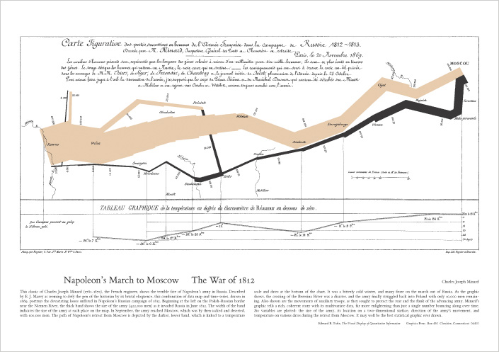
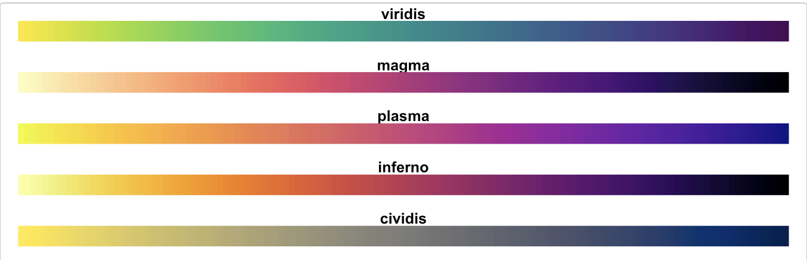
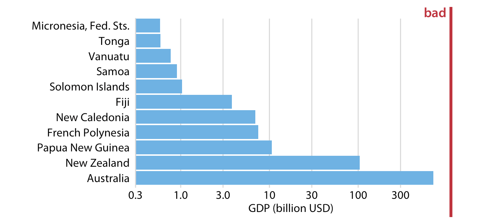
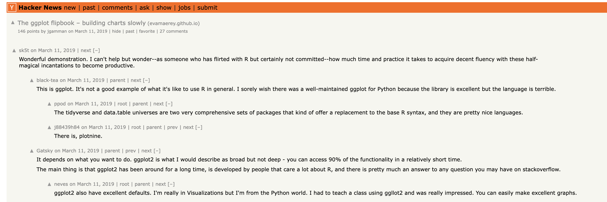
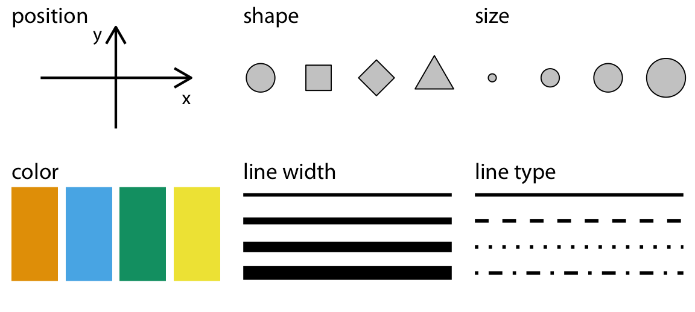
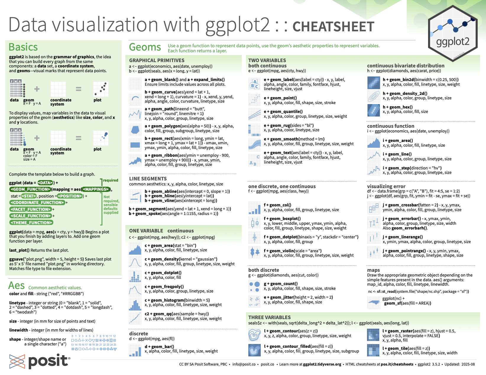

```{r setup, include=FALSE}
knitr::opts_chunk$set(echo = TRUE)
options(tidyverse.quiet = TRUE)
```

## 1. Review assignment...

Respond to each required task with 2 or 3 sentences. 

Task 1: Watch the first 11 minutes enough of Meeks talk so that you can answer the question: **The "Grammar of Graphics" wave is wave 2, according to Meeks.  How does it contrast with wave 2 contrast with wave 1, according to Meeks.**

[Elijah Meeks Keynote at Tapestry 2018: Third Wave Data Visualization (Links to an external site.){alt="Elijah Meeks Keynote at Tapestry 2018: Third Wave Data Visualization"}](https://www.youtube.com/watch?v=itChfcTx7ao)

 

Task 2: 

Via the DU library, you should have online access to Leland Wilkinson's seminal work, "The Grammar of Graphics".    

Try this link or just search for the book on the DU library website.  Read about the "Napoleon's March" graphic in the "Coda" (Chapter 20) of the book.  What are the aesthetics (color, position, shape, line-width, etc) that represent data about the famous march? 

 

Task 3a "Colormaps are an interface between your data and your brain." Watch the video on the viridis (green in Latin) palettes (20 minutes).  **What are the advantages of the viridis color palettes?**

[A Better Default Colormap for Matplotlib \| SciPy 2015 \| Nathaniel Smith and Stéfan van der Walt (Links to an external site.)](https://www.youtube.com/watch?list=PLYx7XA2nY5Gcpabmu61kKcToLz0FapmHu&v=xAoljeRJ3lU)

Task 3.b **Of the viridis palettes, tell me which are you most interested to use:** "Viridis", "magma", "plasma", and "inferno", "cividis"? [ (Links to an external site.)](https://cran.r-project.org/web/packages/viridis/vignettes/intro-to-viridis.html)



4\. Browse 'Fundamentals of Data Visualization' [https://clauswilke.com/datavizLinks to an external site.](https://clauswilke.com/dataviz/proportional-ink.html) Find two figures marked 'Bad' in red, like the one below, and summarize the reasons the author thinks the visualization fails. 

 



## 2. Review of week 1

```{r, echo = F}
replace_vowels_in_bold <- function(text) {
  # Find all **bold** matches and their positions
  pattern <- "\\*\\*.*?\\*\\*"
  matches <- gregexpr(pattern, text, perl = TRUE)
  matched_strings <- regmatches(text, matches)[[1]]
  
  # For each match, replace vowels inside the ** **
  replacements <- sapply(matched_strings, function(m) {
    inner <- substr(m, 3, nchar(m) - 2)  # strip leading and trailing **
    inner_replaced <- gsub("[aeiou]", "\\\\_", inner)
    paste0(inner_replaced)
  })
  
  # Substitute back into the original string
  result <- text
  for (i in seq_along(matched_strings)) {
    result <- sub(matched_strings[i], replacements[i], result, fixed = TRUE)
  }
  
  result
}
```

```{r, results='asis', echo = F}
readLines("week-1-review.md") |> 
  paste(
collapse = "

") |> 
  replace_vowels_in_bold() |> cat()

```

## 3. More ggplot2/grammar of graphics practice...



1.  data - the declarative mood
2.  aesthetics (encoding) - the interrogative mood

    a. y position
    b. x position
    c. size
    d. color (and fill color)
    e. linetype
    f. transparency



3.  geoms (marks) - nouns
    
    static: cheatsheet

https://rstudio.github.io/cheatsheets/data-visualization.pdf




### Some data manipulation for further plotting...

```{r}
library(tidyverse)
library(gapminder)

gap2002 <- gapminder |> 
  filter(year == 2002)

gap_num_countries <- gapminder |>
  distinct(country, continent) |> 
  count(continent)
```

