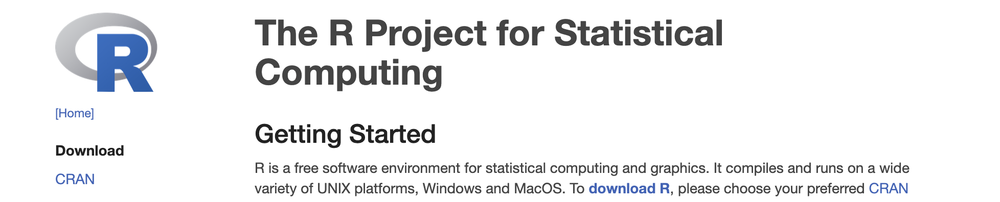
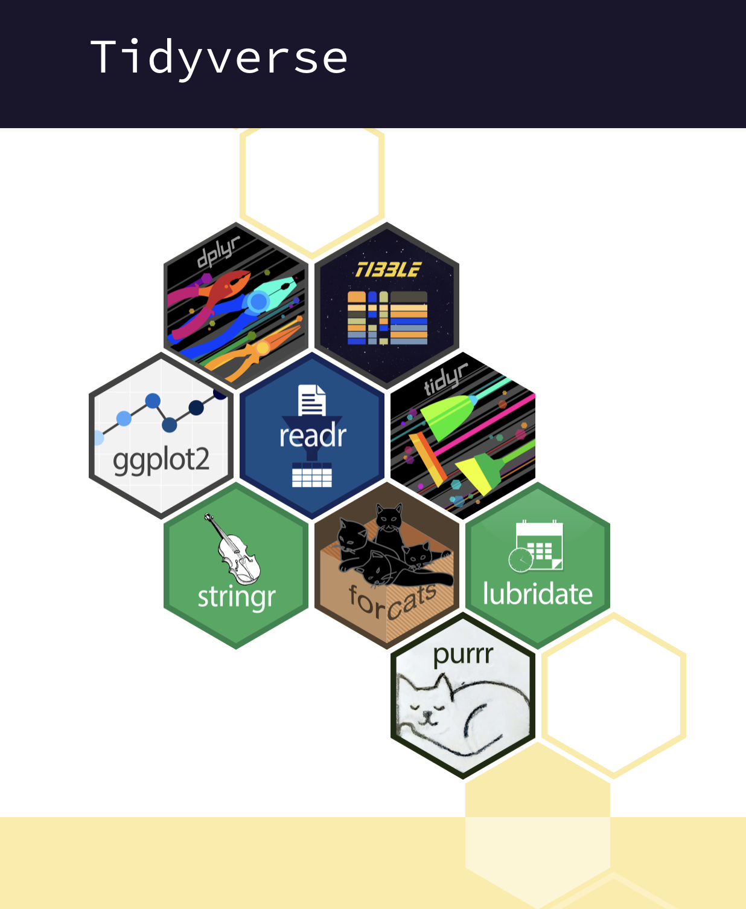
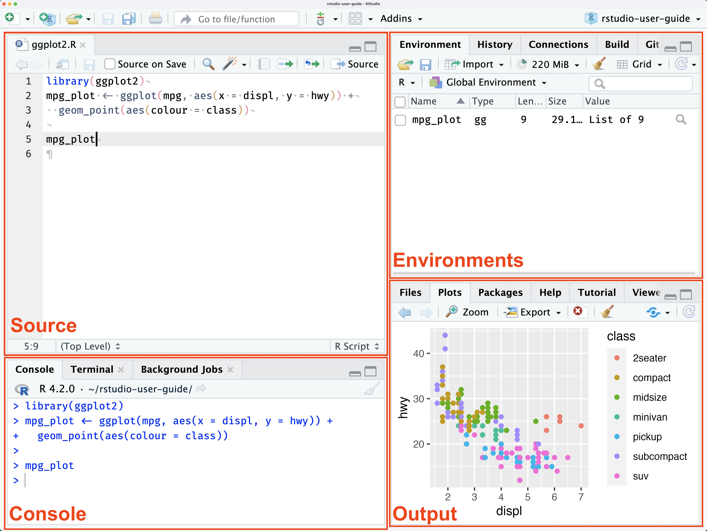
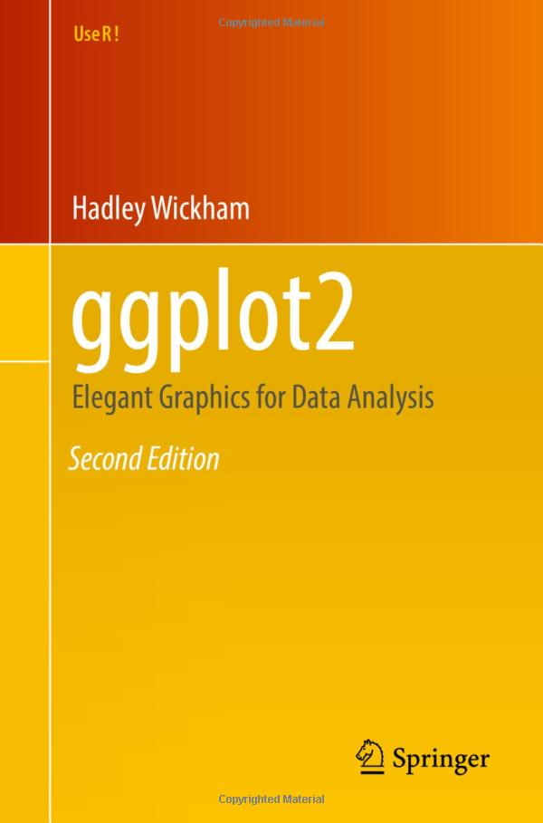

### Introductions

Last week we learned about the R, a language for **statistical computing**. And we learned about CRAN, the **Comprehensive R Archive Network** which is used to share R "**packages**". Packages distribute code or data that is too specialized for the R language itself. A first package we downloaded from CRAN was the data package, **babynames**, with the `install.package("babynames")` command.



An ecosystem of R packages is the '**tidyverse**', which is designed for common data analysis tasks and whose orchestrator is **Hadley** Wickham.

{width="117"}

{width="146"}

With R code, we saw that we could store information in objects. For example we stored numeric values in objects named `x` and`y`. And instructions in **functions** with names like `x_plus_y`. And **data frames** (that have values stored in columns and rows) in objects with names like `gap2002`. All of these objects can created using the assignment operators, `=` or `<-`, (and even `->`)

``` r
my_new_object = 1
x <- 5
y = 6
my_vector_of_numbers <- c(2,4,1,6,2)
adding <- function(x, y){x + y}
```

### Reproducibility

We talked about how using *code* to perform analysis allows for greater **reproducibility** meaning that we or others can rerun our analysis in a precise way.

We were introduced to **RStudio** which is an integrated development environment (IDE). At first, we used the console to try out some simple mathematical operations with the R programming language. Using the console is kind of like a casual conversation in the R language! To allow for greater reproducibility - to **record** our analytic 'conversation' – we've been created a '**quarto**' file, which allowed us to write prose (**natural language**), and code. Upon **rendering** the quarto document, the prose, code and output (graphs, or calculated values) were all published together and viable in the viewer pane of RStudio. The quarto file itself (the 'source' file) has a .qmd extension, and we 'rendered' it to a new 'html' which is what the viewer pane displayed.



## Data **visualization**

We also talked about **data visualization** being an especially powerful way to both **explore** and **communicate** about data, because visualized data can be **pre-attentively processed** that's processing without even mentally focusing on them. That is, the patterns in the data are noticed in an **effortless** way when visualized (patterns that would be really hard to notice if the data were not visualized, and just in a table).

We were introduced to **ggplot2**, a foundational package of the **tidyverse** that implements the **grammar of graphics** philosophy described in Leland Wilkinson, book "the Grammar of Graphics". This framework describes the **components** of data visualizations (or 'statistical graphics; as he calls them), and advocates for systems that allow these components to be declared **independently**.

{width="293"}

The ggplot2 system requires at least three of the graphical components to be declared:

1.  The **data**

2.  The aesthetic **mapping** (or visual encoding how variables should be represented thinks like color, x-position, y-position, linetype, size, which ggplot2 calls '**aesthetics**'

    ... and..

3.  Geometric shapes that can take on these **visual aesthetics** Examples of these 'geoms', are lines, points, rectangles, bars.

{width="161"}

We learned about the **gapminder** project, watched a video of **Hans** Rosling presenting the gapminder data, and we used ggplot2, to produce a frame (2002) of the animated version of the plot he put together.
