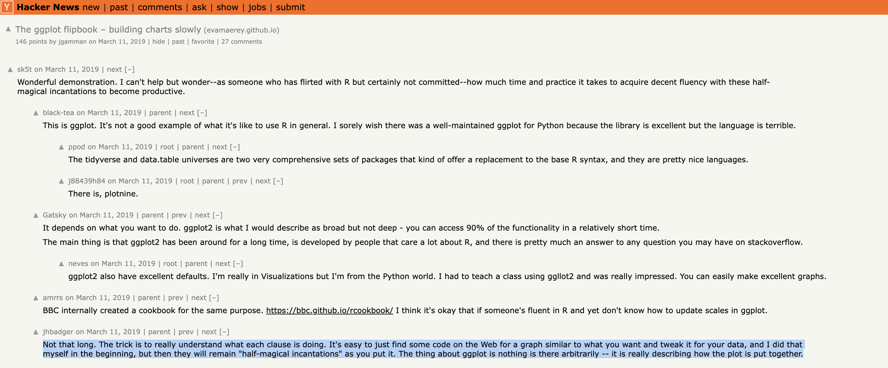
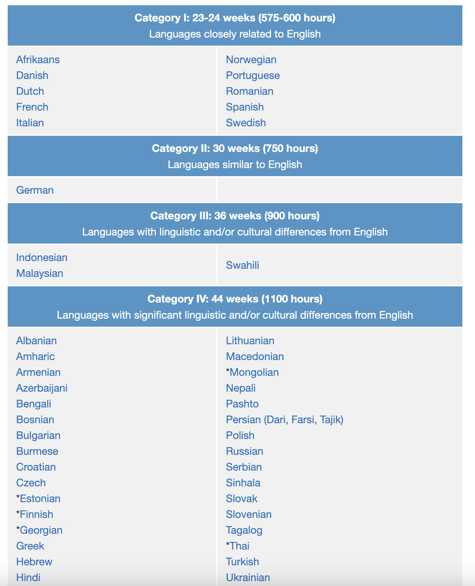
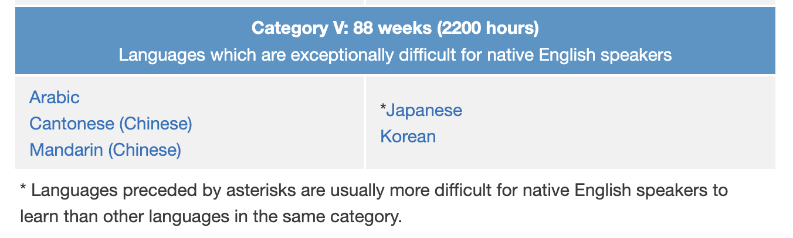
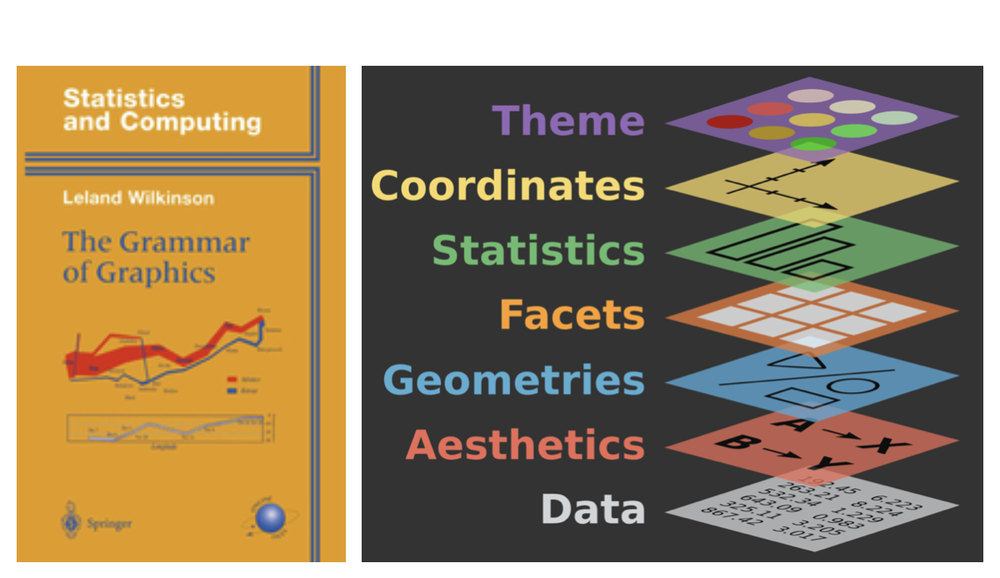
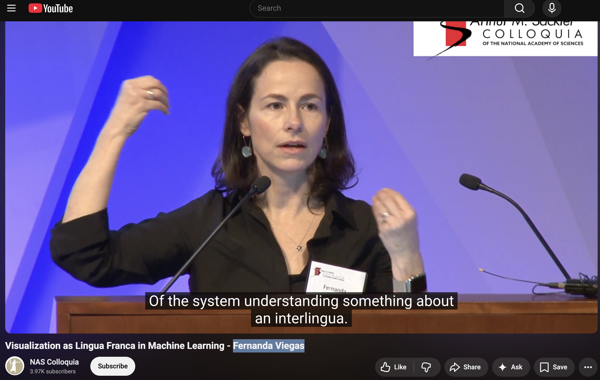
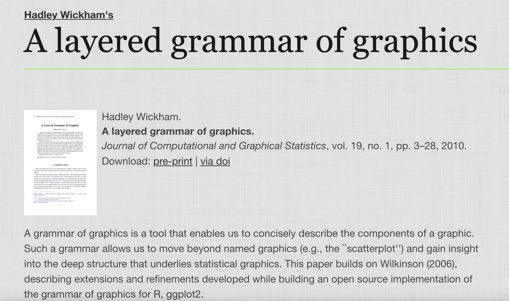
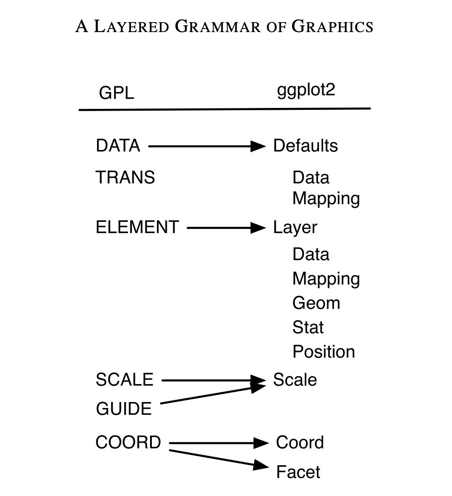
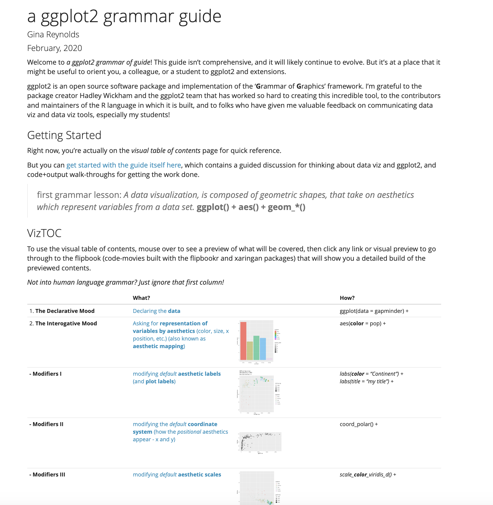
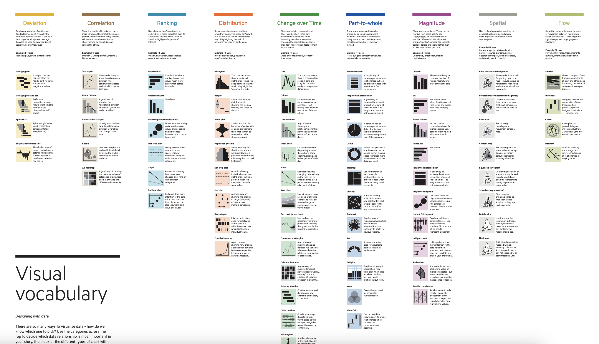
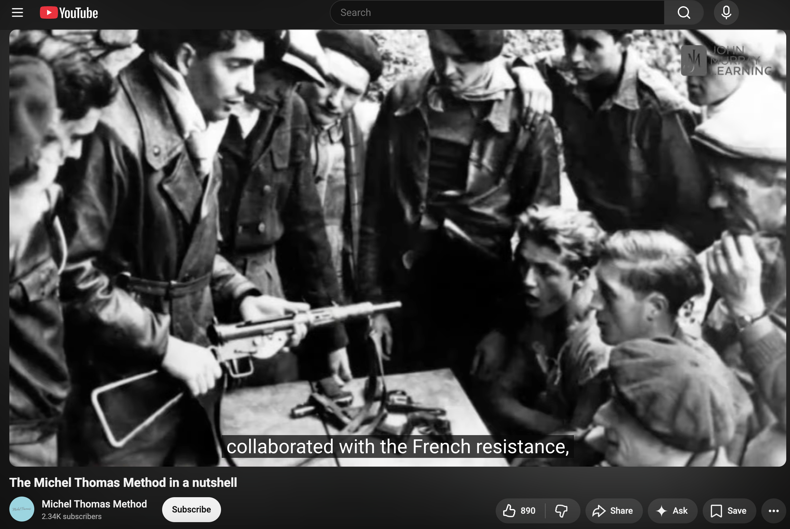

```{r setup, include=FALSE}
knitr::opts_chunk$set(echo = TRUE)
options(tidyverse.quiet = TRUE)
```



## Languages data

The Foreign Service Institute (FSI) has created a list to show the approximate time you need to learn a specific language as an English speaker.





```{r, eval = T, fig.show='hide'}
library(ggplot2)
library(tidyverse)

tribble(~language, ~level, ~weeks,
        "Spanish",    1,   23.5,
        "Portuguese", 1,   23.5,
        "German",     2,   30,
        "Mandarin",   5,   88) ->
  language_levels


language_levels |> 
  ggplot() + 
  # order this variable as it appears in data
  # else we'll be alphabetical
  aes(x = language |> fct_inorder()) +
  aes(y = weeks) + 
  geom_col() +
  aes(fill = level) + 
  labs(y = "Weeks") + 
  labs(x = NULL) + 
  labs(fill = "Level") + 
  labs(title = "The Foreign Service Institute (FSI)'s lanugage Levels",
       subtitle = "my subtitle",
       caption = "my caption") + 
  scale_fill_viridis_c() + 
  scale_y_reverse() + 
  theme_minimal(ink = "blue", 
                paper = "blanchedalmond", 
                base_size = 15)
  

colors()

```

# Esperanto?


```{r}
library(tidyverse)

tribble(~language, ~level, ~weeks,
        "Spanish",    1,   23.5,
        "Portuguese", 1,   23.5,
        "German",     2,   30,
        "Mandarin",   5,   88) ->
  language_levels


language_levels |> 
  ggplot() + 
  # order this variable as it appears in data
  # else we'll be alphabetical
  aes(x = language |> fct_inorder()) +
  aes(y = weeks) +
  geom_col() 


```


Esperanto is ***the most successful constructed international auxiliary language***, and the only such language with a sizable population of native speakers. <https://en.wikipedia.org/wiki/Esperanto>

1/4 of the time as non-constructed languages!?!

Is ggplot2 like Esperanto?

--

Consistency and discipline will keep the language

-   predictable
-   easy to learn
-   easy to use



... Though sometimes there's room for improvement...

-   <https://github.com/tidyverse/ggplot2/issues/6833>
-   <https://github.com/tidyverse/ggplot2/issues/6559>

```{r}
library(ggplot2)
library(tidyverse)

p <- language_levels |> 
  ggplot() + 
  aes(x = language |> fct_inorder(), 
      y = weeks) + 
  geom_col(width = .3)

p

p + coord_polar() # Adds interest? Harder to interpret?  

p + coord_equal() # 1:1 aspect ratio (Not great choice for this data)
```

In what way is ggplot2 like English? (even though English is not totally predictable.

English today's 'Lingua Franca' - most spoken language in the world and bridge language

Zero-shot translation: https://youtu.be/xH19VRSOG7g?si=O4zOqGCdnQSOauWM&t=1007

ggplot2...

-   very successful
-   ggplot2 syntax a bridge language? between:
    -   visual 'language' (visual channels (color, position, shape), tried and true chart types)
    -   computers (programmed to interpret syntax, and render viz)
    -   human language (syntax is close to how we might describe things)

"Visualization as Lingua Franca in Machine Learning"...- Fernanda Viegas



Varga Paraphrase: "data visualization is a window into statistical/ML understanding (and the phenomenon we study with statistics/ML)"

------------------------------------------------------------------------

### ggplot: 'The "Layered" grammar of graphics'

What does 'layer' refer too?

# 

{width="277"}



Exercises

1.  point, tile pile
2.  lollipop

Text and annotation

1.  geom_text, geom_label
2.  annotate("text", label = "hello")

---

Open ended exercise, use the cheat sheet or 'grammar guide' and create two more chart with a geom that we haven't used. Style with labs(), theme\_\*(), and more!

---

<https://evamaerey.github.io/ggplot2_grammar_guide/about>





---

Michel Thomas?

<https://www.youtube.com/watch?v=U9Xh-by50pI>



<https://www.youtube.com/watch?v=U9Xh-by50pI>
