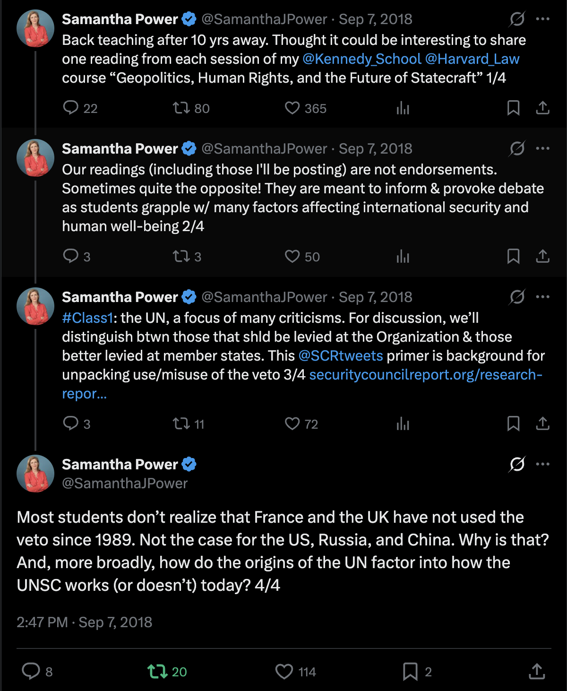
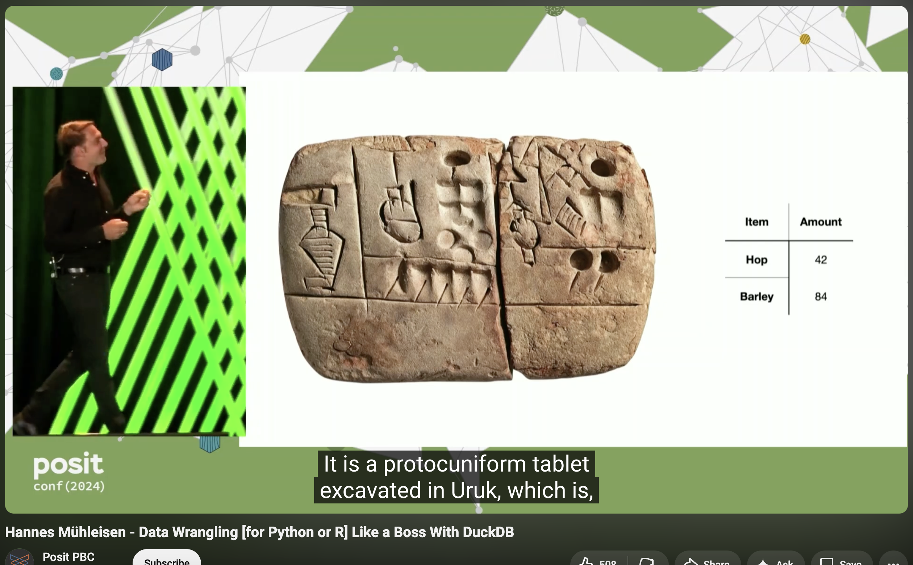
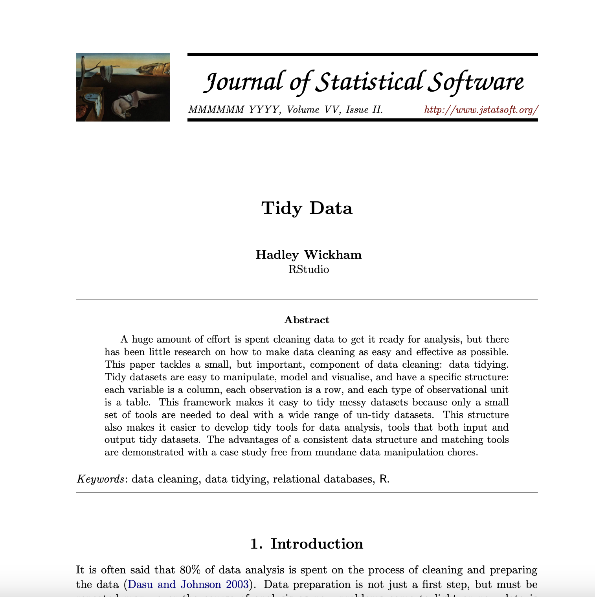
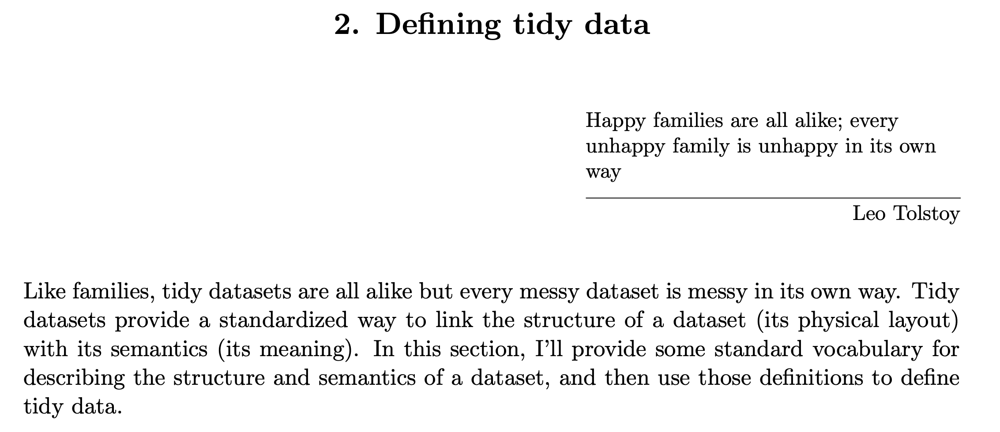
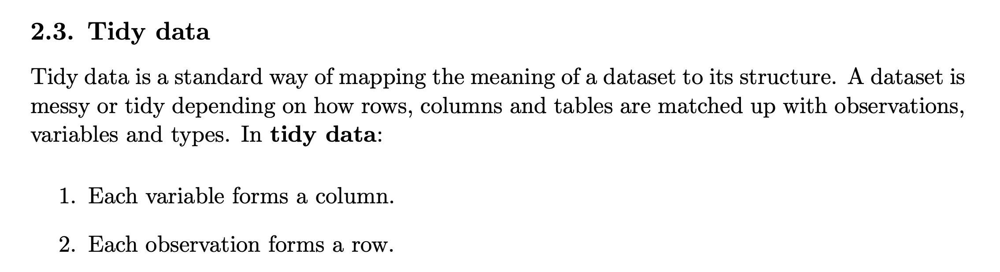
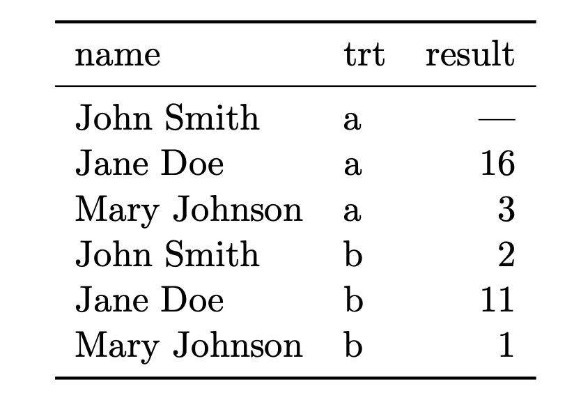
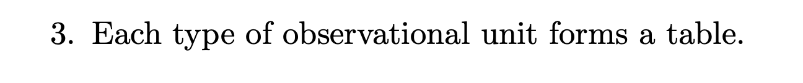

```{r setup, include=FALSE}
knitr::opts_chunk$set(echo = TRUE, dev = "ragg_png", dpi = 300)
options(tidyverse.quiet = TRUE)
```

## Assignment: Who is Samantha Power?

> Task 1. Samantha Power asks: 'Most students don’t realize that France and the UK have not used the veto since 1989. Not the case for the US, Russia, and China. Why is that?' Who is she such that she might find this question especially interesting?



> Task 2. Name two or three area of international relations (is it also security council politics?) that interests you, broadly speaking? Foreign aid? International conflict? Security Council Voting? Foreign direct Investment?

> Task 3. If we try to frame the question as a research question we might say there is an 'outcome to be explained' (or variation in the world to explain): France and UK are not using veto where as China, US, and Russia do. The variation is binary, does-doesn't, type variation. In your areas of interest, is there some variation in the world that we can observe? *Amount* of foreign aid? Aid flows? *Votes* on the council? Investment flows?

> Task 3. There are several explanations for the variation that Power's notices:

-   relative difference in material capabilities/power of the permanent members.

-   change in the relative salience of issues voted upon in the Security Council.

-   strong relationships between France and UK with non permanent members

-   something else?

------------------------------------------------------------------------

> ... What are some of the possible explanations for the variation that you are interested in?

Examples:

-   Amount of foreign aid \<- Need

-   Amount of foreign aid \<- placating behavior?

## wrapping up ... 'layers' in ggplot2

### Create a plot with assignments:

-   `geom_line()`
-   `geom_histogram()`
-   `geom_rug()`
-   `geom_density_2d()`
-   `geom_dotplot()`

```{r}
library(tidyverse)
library(gapminder)

#
gapminder <- gapminder |> 
  mutate(life_exp_cats = 
           case_when(lifeExp >= 70 ~ "Long Life Expectancy",
                     lifeExp < 70  & lifeExp >= 50 ~ "Medium Life Expectancy",
                     lifeExp < 50 ~ "Short Life Expectancy"),
         income_cat = 
           case_when(gdpPercap >= 30000 ~ "High Income",
                     gdpPercap < 3000  & lifeExp >= 10000 ~ "Medium Inncome",
                     gdpPercap < 1000 ~ "Low Income"))


### data subsets
gap_2002 <- gapminder |> 
  filter(year == 2002)

gap_americas <- gapminder |> 
  filter(continent == "Americas")

# univariate continuous
gap_2002 |> 
  ggplot() + 
  aes(x = gdpPercap) + 
  geom_rug() 
```

```{r}
# bivariate, 2 continuous
gap_2002 |> 
  ggplot() + 
  aes(x = pop, y = lifeExp) + 
  geom_point() +
  # geom_density2d() + 
  scale_x_log10() + 
  # geom_bin2d() + 
  geom_hex()
  


# multi series
gap_americas <- gapminder |> 
  filter(continent == "Americas")

gap_americas |>
  ggplot() + 
  aes(x = year, 
      y = gdpPercap, 
      group = country) + 
  geom_line()


```

### Again Take one of the assigned 'geoms' from the cheat sheet or grammar guide we haven't already used, and create a plot and be prepared to describe it:

-   geom_boxplot\
-   geom_violin - discrete X continuous
-   geom_jitter
-   geom_count\
-   geom_bin2d

```{r}
library(ggplot2)
library(gapminder)

### data subset
gap_2002 <- gapminder |> 
  filter(year == 2002)

# bivariate, continuous X discrete
ggplot(gap_2002) + 
  aes(x = continent) + 
  aes(y = gdpPercap) + 
  geom_violin() + 
  geom_point()


ggplot(gap_2002) + 
  aes(x = continent) + 
  aes(y = gdpPercap) + 
  geom_boxplot() + 
  # geom_point() + 
  geom_jitter(width = .1, height = 0, alpha = .5)

# bivariate, discrete X discrete


# bivariate, continuous X continuous


```

### ggplot2 cheat sheet -\> language school classroom posters?

```{r, echo = F, message = F, warning=F}
library(patchwork)

p0 <- ggplot()

p <- ggplot(cars) + 
  aes(x = speed)

inset_center <- function(plot, x = .5, y = .5, width = .25, height = .25){
  
  inset_element(plot, 
                left = x - .5*width, 
                right = x + .5*width, 
                top = y + .5*height,
                bottom = y - .5*height, 
                align_to = 'full')
  
}

# p0 + inset_center(p)


inset_around <- function(plot, angle = 360, r = .35, x0 = .5, y0 = .5, width = .25, height = width){
  
  radians <- angle*pi/180
  
  inset_element(plot, 
               left = x0 + cos(radians)*r - .5 * width,
               right = x0 + cos(radians)*r + .5 * width,
               top = y0 + sin(radians)*r + .5 * width,,
               bottom = y0 + sin(radians)*r - .5 * width,
               align_to = 'full')
  
}

p <- ggplot(cars) + 
  aes(x = speed)


around <- 360/5*1:5

ggplot() + 
  inset_around(p, r = 0, width = .4) + labs(
    subtitle = "Base plot: \np <- ggplot(cars)\n   + aes(x = speed)") +
  inset_around(p + geom_density()) + labs(subtitle = "p + geom_density()") +
  inset_around(p + geom_rug(), 90) + labs(subtitle = "p + geom_rug()") +
  inset_around(p + geom_histogram(), 180) + labs(subtitle = "p + geom_histogram()") +
  inset_around(p + geom_freqpoly(), 45, r = .4) + labs(subtitle = "p + geom_freqpoly()") +
  inset_around(p + geom_dotplot(), 270) + labs(subtitle = "+ geom_dotplot()") +
  plot_annotation(title = "Univariate Continuous") &
  theme_void(ink = "steelblue", paper = "grey99") &
  theme(panel.grid = element_line(linewidth = .05), 
        plot.margin = margin(10,10,10,10,unit = "pt"),
        plot.background = element_rect(color = "steelblue", linewidth = .1)) 
  

```

------------------------------------------------------------------------

# New agenda item: tables, and data manipulation ('wrangling')...

*data cleaning, wrangling, tidydata*

> Wrangle. "From Middle English wranglen, from Low German wrangeln (“to wrangle”), frequentative form of Low German wrangen (“to struggle, make an uproar”) and German rangeln (“to wrestle”)."
>
> "He who has a why to live can bear almost any how." -- Friedrich Nietzsche

<https://www.youtube.com/watch?v=GELhdezYmP0>



```{r}
library(tidyverse)

```

# "Tidy Data"



Analyst frustration:





{width="580"}

## Within columns, information is 'like-in-kind'

--

like in kind?

-   All numerics, all Strings, all factors (categories), all logical (TRUE/FALSE), all ordered factors (categories with an order).

-   Also, no rows with summaries - 'raw' table

Observational unit?

```{r}
library(tidyverse)
uruk_3200bc <- tribble(~item, ~amount,
        "hop", 42,
        "barley", 84)

uruk_3200bc

uruk_3200bc |> 
  ggplot() + 
  aes(x = item,
      y = amount,
      fill = item) + 
  geom_col() + 
  labs(title = "'We can only imagine what they were making...' 🙃")

```

### is the gapminder data tidy?

```{r}
library(gapminder)
gapminder

```

{width="560"}

# Wrangling exploration...

## In class...

[Wrangling 'moves'](wrangle_away.html)


## Full data set, for reference

```{r}
library(gapminder)
gapminder

```

[Wrangling syntax](https://evamaerey.github.io/data_manipulation/about)

| function    | action                                                    |
|-------------|-----------------------------------------------------------|
| filter()    | keep rows (if true)                                       |
| select()    | keep variables (or drop them -var)                        |
| mutate()    | create a new variable                                     |
| distinct()  | keep unique                                               |
| case_when() | is used for “recoding” variable, often used with mutate() |
| rename()    | renaming variables                                        |
| arrange()   | order rows based on a variable                            |
| slice()     | \*keep or drop rows based on row number                   |

------------------------------------------------------------------------

------------------------------------------------------------------------

------------------------------------------------------------------------

<details>[Wrangling 'moves' answers....](wrangle_away_answers.html)</details>
