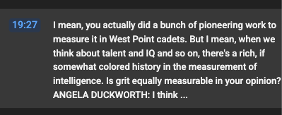
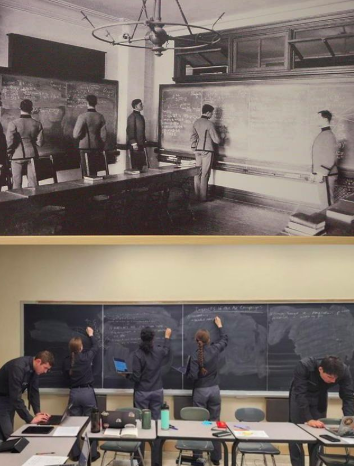

## The grittier the military service-people, the better the defense.

<https://angeladuckworth.com/grit-scale/>

> Angela Duckworth, PhD, is a 2013 MacArthur Fellow and professor of psychology at the University of Pennsylvania. An expert in non-I.Q. competencies, she has advised the White House, the World Bank, NBA and NFL teams, and Fortune 500 CEOs. Prior to her career in research, she taught children math and science and was the co-founder of a summer school for low-income children that won the Better Government Award from the state of Massachusetts. She completed her BA in neurobiology at Harvard, her MSc in neuroscience at Oxford, and her PhD in psychology at the University of Pennsylvania. More recently, she co-founded the Character Lab, a nonprofit whose mission is to advance the science and practice of character development in children.


------------------------------------------------------------------------



## Probability and Statistics at West Point?

pen-and-paper, blackboards, some data vis, some statistical compute.

--

Chalkboards



(and actually every class)

> "Boards"

------------------------------------------------------------------------

```{r}
#prop.test()

```

------------------------------------------------------------------------

> For survey of 161 individuals on willingness to serve as organ doners in the case of an accident, is there evidence that responses rate differs from a 50/50 split, when 53 individuals respond 'no' and 108 individuals respond 'yes'?

------------------------------------------------------------------------

------------------------------------------------------------------------


```{r setup, include=FALSE}
knitr::opts_chunk$set(echo = TRUE)
options(tidyverse.quiet = TRUE)
```

## Intro Thoughts

## Status Quo

```{r}
library(tidyverse)

```

## Experiment

```{r}

```

## Closing remarks, Other Relevant Work, Caveats
